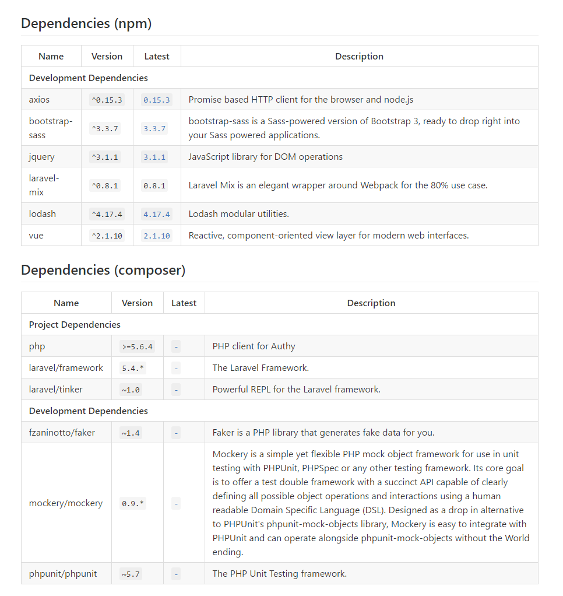

# Package Hub

> An extension for displaying dependencies for different package managers on GitHub

### Package Manager Support
- [x] Npm/Yarn.
- [x] Composer.
- [x] Pip.
- [x] Cargo.

### Usage
Clicking the extension icon opens a popup where you can provide an API key from libraries.io that you can get from [here](https://libraries.io/api). This API key allows the extension to make bulk requests instead of single ones which improves the experience greatly. Encountering projects with too many dependencies now works correctly. It is a little unpleasant, but getting an API key is worth it.

### Rationale
Why build this? We already have [npmhub](https://github.com/npmhub/npmhub)?
> npmhub is great, but why should npm have all the fun?
I wanted to see if I could implement something similar while making it easy to
add support for other package managers.
Also, to make it more fun, I decided to accomplish this without any fancy libraries (jQuery) or apis (fetch). So, packagehub should have support for most browsers in use today.

## Related
* [npmhub](https://github.com/npmhub/npmhub) - inspired the idea for this extension.

## Install
- [**Firefox** Add-on](https://addons.mozilla.org/en-US/firefox/addon/package-hub)
- [**Chrome** Extension](https://chrome.google.com/webstore/detail/package-hub/hnnjnbmjanpeoeapjllonejjgoonilal)
- **Opera** extension: Use [this Opera extension](https://addons.opera.com/en/extensions/details/download-chrome-extension-9/) to install the Chrome version.

## Development

1. Clone this repo.
2. Go to chrome extensions [chrome://extensions](chrome://extensions).
3. Enable developer mode.
4. Click on load unpacked extension and select the source folder of this cloned repo.

To add support for a new package manager

1. Add a new [config](src/config.js) entry with the relevant details. The registry in the config should be one of the supported ones in [Libraries.io](https://libraries.io/)
2. Add a new [parser](src/parser.js) if the package manager dependencies are not specified in one of the already existing formats (JSON, TOML, etc.).

### Appreciation
Thanks to [Libraries.io](https://libraries.io/) for providing an excellent api with returns just the right amount of data to make this extension useful without being wasteful.

## License
MIT © Ezinwa Okpoechi
